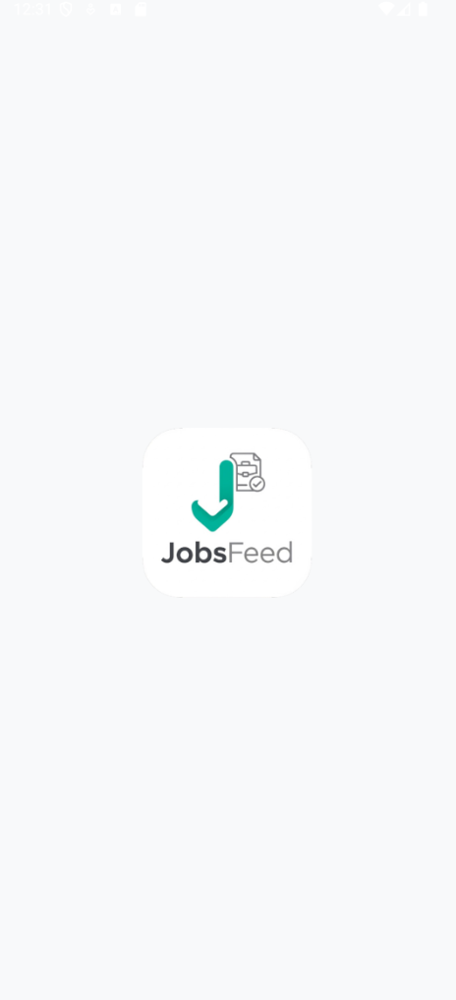
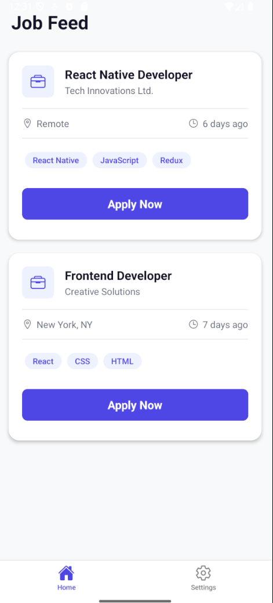
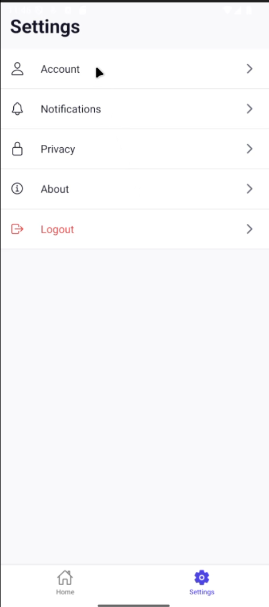

# JobsFeed - React Native Mobile App

This project is a mobile application for browsing job listings, built as a submission for the React Native Intern Assignment. The app is designed with a modern, clean, and attractive user interface and is built following best practices for code quality, folder structure, and reusability.

The application features a native splash screen, a home feed to display jobs, and a settings screen. It uses a mock data source to simulate a real-world backend.

## Screenshots


| Splash Screen                               | Home Feed                                 | Settings                                  |
| ------------------------------------------- | ----------------------------------------- | ----------------------------------------- |
|  |  |  |

## Features

-   **True Native Splash Screen:** A professional, native launch screen with a custom logo that prevents any white flash on startup.
-   **Dynamic Job Feed:** A scrollable home screen that displays a list of jobs from a mock data source.
-   **Modern UI/UX:** A "posh" and attractive design with a clean color palette, proper spacing, and reusable components.
-   **Apply Once Logic:** Users can apply for a job only once. The "Apply Now" button becomes disabled and changes its style after a job has been applied for.
-   **Tab-Based Navigation:** Simple and intuitive navigation between the Home and Settings screens.
-   **Visible Icons:** All icons are correctly linked and visible on Android.
-   **Optimized for Release:** The final APK is optimized for size by splitting builds per architecture and selectively bundling only the necessary assets.

## Tech Stack

-   **Core:** React Native
-   **Navigation:** React Navigation (Stack Navigator, Bottom Tab Navigator)
-   **UI Components:** Reusable custom components (Card, Button, Header).
-   **Icons:** `react-native-vector-icons`
-   **Native Splash Screen:** `react-native-splash-screen`
-   **Language:** JavaScript (ES6+), Kotlin (for Android native modules)
-   **Build Tool:** Gradle

## Folder Structure

The project follows a modular and scalable folder structure to ensure code quality and maintainability.

```
JobsFeed/
├── src/
│   ├── api/
│   │   └── mockData.js         # Dummy data for the app
│   ├── assets/
│   │   └── images/             # App logo and other images
│   ├── components/
│   │   ├── common/             # Reusable components (Button, Card, Header)
│   │   └── ...                 # Feature-specific components
│   ├── navigation/
│   │   └── AppNavigator.js       # Navigation logic (Stack/Tabs)
│   ├── screens/
│   │   ├── auth/
│   │   │   └── SplashScreen.js   # Logic to hide native splash screen
│   │   └── main/
│   │       ├── HomeScreen.js
│   │       └── SettingsScreen.js
│   ├── styles/
│   │   ├── colors.js           # Centralized color palette
│   │   └── typography.js       # Centralized font styles
│   └── utils/
│       └── helpers.js          # Utility functions
└── App.js
```


## Setup and Installation

### Prerequisites

-   [Node.js](https://nodejs.org/) (LTS version recommended)
-   [JDK (Java Development Kit)](https://www.oracle.com/java/technologies/downloads/) (Version 17 recommended)
-   [Android Studio](https://developer.android.com/studio) (for Android SDK and emulator)
-   React Native development environment. Follow the official guide for [setting up the development environment](https://reactnative.dev/docs/environment-setup).

### Installation Steps

1.  **Clone the repository:**
    ```bash
    git clone https://github.com/namanabbad02/JobsFeed.git
    ```

2.  **Navigate to the project directory:**
    ```bash
    cd src
    ```

3.  **Install dependencies:**
    ```bash
    npm install
    ```

4.  **iOS Setup:**
    ```bash
    cd ios && pod install
    ```

5.  **Android Setup (Crucial Step):**
    Create a file named `local.properties` inside the `android` folder with the following content, pointing to your Android SDK location:
    ```properties
    # For Windows (use double backslashes)
    sdk.dir = C:\\Users\\YOUR_USERNAME\\AppData\\Local\\Android\\Sdk

    # For macOS/Linux
    # sdk.dir = /Users/YOUR_USERNAME/Library/Android/sdk
    ```

## Available Scripts

### `npm start`

Runs the Metro bundler, which serves the JavaScript bundle to your app.

### `npx react-native run-android`

Builds the app and installs it on a connected Android emulator or physical device.

### `npx react-native run-ios`

Builds the app and installs it on a connected iOS simulator or physical device (macOS only).

## Generating a Release APK

To generate a shareable, optimized APK file for Android:

1.  Navigate to the `android` directory:
    ```bash
    cd android
    ```

2.  Run the `assembleRelease` command:
    ```bash
    # For Windows
    gradlew.bat assembleRelease

    # For macOS/Linux
    ./gradlew assembleRelease
    ```

The generated APK files (e.g., `app-arm64-v8a-release.apk`) will be available in `android/app/build/outputs/apk/release/`.
